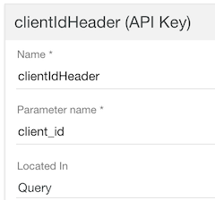
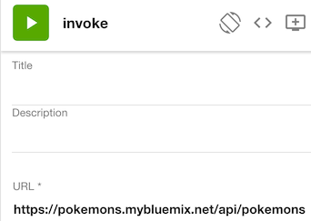
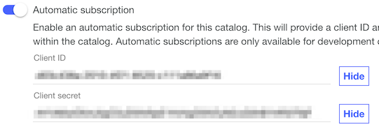
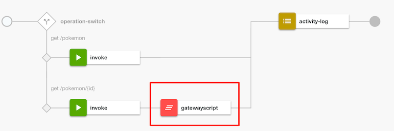
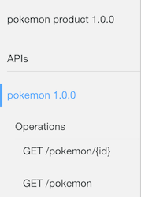

# Building disruptive digital applications using APIs

## Pre requisites

* IBM Bluemix account

## Overview

To be a successful business and provide increased value to your consumers, one needs to continue to innovate while achieving cost optimization. Exposing key business services to business partners will help drive new forms of collaboration, increase revenue opportunities, and provide higher value services to your customers. You can also expose your internal services to your internal developer communities, to drive application development consistency, reduce IT costs, and promote standard use of enterprise-approved services across your organization.

Business services are exposed with APIs. An API management solution is imperative to the success of externalizing the core services by providing easy assembly of new APIs, enabling security and different levels of service, providing management and insight to developers and business users, and socializing those APIs to developers, through communities and portals. This enables organizations to participate in the API economy, with rapid, highly secure connections between API providers and API consumers.

IBM API Connect delivers a complete API platform to Create + Run + Secure + Manage API services. You can create new API services and natively connect to datasources, such as databases or securely expose existing REST / SOAP services as API services. It provides detailed analytics and operational metrics to the business owner and a customizable developer portal to socialize the APIs.

### Table of Contents

1. [Create an API definition](#create-an-api-definition)
2. [Publish an API definition](#publish-an-api-definition)
3. [Test an API definition](#test-an-api-definition)
4. [Secure and optimize API message flows with an API assembly](#secure-and-optimize-api-message-flows-with-an-api-assembly)
5. [Discover API services using the developer portal](#discover-api-services-using-the-developer-portal)
6. [Summary](#summary)

## Create an API definition

In this section, you will create a quick API definition to expose an existing REST service as an API service.

1. Let's try to catch some virtual __Pokemon__ (this is what everyone is doing in 2016!). You will create an API definition to proxy an existing Pokemon service. Let's first directly call the backend service to make sure its available, [https://pokemons.mybluemix.net/api/pokemons/](https://pokemons.mybluemix.net/api/pokemons/). You can use any test client (even a Web browser). It should return the following (just showing the first item in the response for brevity):
	```
	{
	"data": {
		"moves": "slow"
	},
	"height": "70",
	"name": "ivysaur",
	"weight": 200,
	"id": "1"
	}
	```
	You will simply proxy the same request now using API Connect.
2. Login to Bluemix with your IBM credentials and select the **Catalog** link. In the search box, type **API Connect** and click on the API Connect link.
3. Select the **Essentials** plan and click **Create** and follow the prompts to provision the service. The provisioning steps may take a few moments to complete.
4. In the Bluemix dashboard, under **Services**, click your recently created API Connect instance. Wait for the automatic login to complete and then click the hamburger icon and then **Drafts**.

	
5. Click the **APIs** tab. 
6. Create a REST API definition - click **+ Add** and then click **New API from scratch**. The "Add a new API" window opens.
	1. In the Title field, enter `pokemon`. This will enter default values for other fields. 
	2. Change the Base Path to `/api`. Make a note of the URI as you will need this when testing.

	

	3. Click **Additional properties**.
 	4. Click **Add Product** and leave the defaults.

	 
 	5. Click **Create API**.
  	
	  This will create an API product with the REST API definition for the Pokemon service.
7. Select **Security Definitions** in the left panel, change the **clientIdHeader (API Key)** location from **Header** to **Query**.

	
	
8. Select **Paths** in the left panel, Click **+ Add** and enter `/pokemon` for the path. Leave the GET parameter. You can add more operations (PUT, POST, DELETE, etc..) if needed, but for now, let's use the GET operation only.
9. Click the **Assemble** link at the top. A default action called **invoke** is pre-configured. Select the **invoke** action and change the URL to https://pokemons.mybluemix.net/api/pokemons. 

	
10. Click **Save** (icon at top right-hand corner) to persist your changes.

## Publish an API definition

1. Click **All APIs** to back to the Drafts page. Click **Products** and the existing **pokemon product**. In the top right corner, click  and stage the API product to the **Sandbox**. This step enable consumers to register and test the API service. 

	
   **Note**: Once a product is staged, it's not formally available until its been published. This step is usually performed by an API administrator. Since we are playing all the roles (its hello world!), you will complete this step.
2. Click the Hamburger icon  on the left-hander corner and select **Dashboard**. Click the **Sandbox** catalog.
3. In the pokemon product row, click the ... and select **Publish**. Leave the default visibility values and click the **Publish** button. Any changes to the API definition requires you to repeat these steps.

## Test an API definition

API Connect provides a developer portal to discover and test APIs. It allows API consumers (ie Mobile Applications) to discover, subscribe and test API definitions. Once they are satisfied with the API, they can then embed the API into their application. 

For simplicity, you will use the built-in test application instead of the developer portal to test the pokemon API definition. The last section of the tutorial will walk you through the developer portal so you can understand the full API experience.

1. In the **Sandbox** catalog, click on **Settings**.
2. Make sure **Info** is selected in the left panel. The **Automatic subscription** toggle should already be selected. Click the **Show** button to note the client ID and client secret (the client secret is not needed for the initial test but note it anyways).
For example, client id is `d03c438a-2010-4f21-8520-c111a86a9f16` and client secret is `rH1lA6wO5nL6gC5uD5tV0pE1hV4gO5lV2yN2uG5hB1hR3iT6jF`.

	

3. Before you can test the application, you will need the API endpoint for testing. Click on **Endpoints** in the left panel and note the API Endpoint. The format for the API endpoint is https://host/org/catalog/uri?client_id=63de0b20-c044-4be3-9b9b-b4321acea089. For example, https://api.us.apiconnect.ibmcloud.com/ibmid-dev/sb/api/pokemon, where URI (/api/pokemon) is defined in your API policy definition.
4. Now test the URL: [https://host/org/catalog/api/pokemon?client_id=63de0b20-c044-4be3-9b9b-b4321acea089](https://host/org/catalog/api/pokemon?client_id=63de0b20-c044-4be3-9b9b-b4321acea089). 

	

	Make sure you get the same JSON response. You know what they say about Pokemon - __Catch 'Em All__!   

## Secure and optimize API message flows with an API assembly

The API Assembly feature within API Connect provides a collection of policies which are enforced and executed on the API Gateway. Policies include actions like modifying the logging behavior and altering the message content or headers. Additionally, if the out-of-the-box policies do not meet your specific needs, you may create your own policy and have it available for API designers through the API Connect UI.

### Add API logging to the API assembly

In this section, you will log the API message into the API analytics engine to gain insight into your API.

1. Switch back to the **Assemble** tab.
2. Add an **activity-log** policy to the assembly.
3. Configure it to log API payload. Drag the activity-log policy from the list of available policies to the right of the invoke policy already created in your assembly.
4. Select the newly added activity-log step. A properties menu will open on the right of your screen. Under **Content** select **payload** from the drop-down list.
	
4. Click on the X icon to close the activity-log editor menu.
5. Save your changes.
6. Restage and deploy the pokemon product. The instructions are mentioned here again, but you will need to remember these steps next time you perform the same action. 
	```
	1. Click **All APIs** to back to the Drafts page. Click **Products** and the existing **pokemon product**. Click the *cloud icon with a top arrow* and stage the API product to the **Sandbox**.  
	2. Click the Hamburger icon on the left-hander corner and select **Dashboard**. Click the **Sandbox** catalog.
	3. In the pokemon product row, click the ... and select **Publish**. Leave the default visibility values and click the **Publish** button. Any changes to the API definition requires you to repeat these steps.
	```

### Verify activity logging in the API Analytics

1. Send a sample message to return Pokemon data.
2. The Analytics data is collected under the common Dashboards. Click the Hamburger icon on the left-hander corner and select **Dashboard**. 
2. Click the **Analytics** tab to view the results. 
3. Scroll down to **5 Most Active APIs**.
4. At the bottom of the section, click the ^ arrow and then click **View Events**.
5. Click the most recent event. In the default (Table) tab, scroll down until you see the **response_body** attribute. You should see the same JSON body in the response.
	

### Use conditional actions to dynamically control flows

In this section, you will create a new operation and add assembly logic to enforce different actions based on the runtime operation (Get All Pokemon vs Get single Pokemon)

Let's first directly call the backend service to make sure its available, [https://pokemons.mybluemix.net/api/pokemons/1](https://pokemons.mybluemix.net/api/pokemons/1). 
	```
	{
	"data": {
		"moves": "slow"
	},
	"height": "70",
	"name": "ivysaur",
	"weight": 200,
	"id": "1"
	}
	```

1. Switch the API designer (All APIs -> pokemon 1.0.0 -> Design).
2. On the left side of the page, under **Paths**, select `/pokemon`.
3. Click the + button to create a new path named `/pokemon/{id}`.
4. Click **Add Parameter** and describe the `{id}` parameter with the following:
	1. Name: id
	2. Located: Path
5. Notice that the response is a JSON object. If you wanted to define a more specific JSON schema, you can create a definition object with the Pokemon attributes. For now, let's leave the defaults so you don't let those Pokemon run away!
	
6. Save the changes.
7. Switch to the Assembly.
8. Drag the Operation Switch to the action before the Invoke.
9. Select the dropdown beside **Case** and select `get /pokemon`. 
10. Click **Add Case** and add select `get /pokemon/{id}`. 
11. Click the + button to close the action. At this point both operations use the same assembly. The `get /pokemon/{id}` requires a different endpoint to be invoked that obtains an individual pokemon instead of all pokemons.
12. Drag the existing Invoke action to the `get /pokemon` operation.
13. Drag another Invoke action into the case for `get /pokemon/{id}` and enter the URL https://pokemons.mybluemix.net/api/pokemons/{id}. Uncheck `Stop on error` since you won't define any error handling logic.
14. Scroll down to the bottom of the Invoke action, under response object variable, enter `pokemon`. 
14. Both cases should use the activity-log. In the next section, you will add an action specific to the `get /pokemon/{id}` flow.

	
15. Save your changes.
16. Restage and deploy the pokemon product. 
17. Test your service again your the following URL: [https://host/org/catalog/api/pokemon/1?client_id=63de0b20-c044-4be3-9b9b-b4321acea089](https://host/org/catalog/api/pokemon/1?client_id=63de0b20-c044-4be3-9b9b-b4321acea089). You can try different integers (1-5) to retrieve other Pokemon.

### Control and enrich API messages using JavaScript

In this section, you will enrich the runtime **response** API payload using JavaScript by configuring a GatewayScript action.

1. The GatewayScript action allows you to copy/paste GatewayScript code directly into the flow. This is not a WYSIWG editor so you cannot directly write code with editor assistance; however, we can use the [DataPower playground](https://developer.ibm.com/datapower/datapower-playground/) to test out code before deploying to API Connect. The flow that you will test in the playground is the response flow. Remember that the backend Pokemon response returns JSON data, so that will be your input JSON message into the playground.
2. Open a new tab to the URL https://developer.ibm.com/datapower/datapower-playground/.
3. Select the **Samples** tab and click the first **Edit and Test** buttons (under Exercise 1: Hello GatewayScript).
4. Add the following code. 
	```
	session.input.readAsJSON(function (error, json) {
    if (error) throw error;

    console.log("Original JSON %s", JSON.stringify(json));
    json['platform'] = 'Powered by IBM API Connect';

    // Write the output to the 'output' context. This
    // is creating a new body in the flow
    session.output.write(json);
    console.info("Modified JSON: %s", json);
	});
	```
	This code reads in the JSON message asynchronously. In the callback method, it injects a new value into the payload.
5. Click the **Request** tab and enter the JSON response. Remember your modifying the **response** payload!
	```
	{
		"data": {
			"moves": "slow"
		},
		"height": "70",
		"name": "ivysaur",
		"weight": 200,
		"id": "1"
	}
	```
6. Click **> Test**. You should get the same Pokemon JSON response but with a new attribute called `platform` with the value `Powered by IBM API Connect`.
	

	You are now ready to apply the similar code to a GatewayScript action in API Connect.
7. Switch back to the API Connect designer and select the **Drafts** page.
8. Navigate back to the **Assembly** tab.
9. Add a GatewayScript action to the  `get /pokemon/{id}` case.
	
10. You wil need to make some changes to the previous code for API Connect. The API Connect framework provides a simplified GatewayScript API to interact with the runtime API payload.  The API framework documentation is available [here](http://www.ibm.com/support/knowledgecenter/SSMNED_5.0.0/com.ibm.apic.toolkit.doc/rapim_context_var.html). Copy the following code into the GatewayScript action:
	```
    //APIC: get the payload
	var json = apim.getvariable('pokemon.body');
	console.error("json %s", JSON.stringify(json));
    
	//same: code to inject new attribute 
	json.platform = 'Powered by IBM API Connect';
	
	//APIC: set the payload
	apim.setvariable('message.body', json);
	``` 
	The code snippets with `APIC` indicate the new code that was used to replace the previous code to get and set the payload. All other code remains the same. The API Connect framework takes care of reading the input message and setting the response back to the consumer. Note that the context variable `pokemon` (from `pokemon.body`) is the same value as the Invoke action, response object variable. The `message` context variable (from `message.body`) is a default context that tracks the modified message.
11. Click on the X to close the editor menu.
12. Save your changes.
13. Restage and deploy the pokemon product. 
14. Test your service again and make sure it returns the same Pokemon data but with a new attribute, `platform` containing `Powered by IBM Connect`.

**Important**
Context variables in the API assembly allow you to access runtime information:
* request: pre-built context variable provides the original request message
* message: pre-built context variable provides access to the current message in the assembly
* pokemon: custom context variable created for storing the response from the Invoke action.

Each context variable has additonal attributes such as `body`, `headers`, etc ... that provide information about different runtime context.

#### Advance: Inject HTTP headers into a response

1. In the same GatewayScript file, you can also inject HTTP request or response headers dynamically. You will need to use a test tool that can view the request and response headers. If your using Chrome, you can use the built-in debugging tools to view header information. 
2. Insert the following code at the end of the GatewayScript action.
	```
	apim.setvariable('message.headers.platform', 'Powered by IBM API Connect');
	```
3. If you need to perform any error handling, the following code allows you to throw an error into the assembly that can be caught with a catch handler (will be discussed next).
	```
	apim.error('MyError', 500, 'Internal Error', 'Some error message');
	```

### Discover remaining API assembly actions

There are several other assembly actions that you can explore, we will discuss them here quickly, so you can explore them on your own time.

1. The `switch` and `if` actions allow you to specify conditional actions in the assembly flow, similar to the `operation-switch` but with more flexibility to define the conditions based on the runtime context (eg. HTTP method, operation name, message body details, etc ...)
2. You can define a catch block that will act as a global error handler in your assembly. Select the **Show Catches** toggle. Click inside the Catch area to define assembly logic for common error conditions. The default errors are defined [here](http://www.ibm.com/support/knowledgecenter/SSMNED_5.0.0/com.ibm.apic.toolkit.doc/ref_toolkit_catch_errors.html).
3. The `throw` action triggers an error message to be returned to the client. Use this action when you have reached an error condition in your assembly flow. This action can subsequently trigger the global error handler via the `catch` block.
4. Several policies are available for performing message transformations, such as `Map` (schema to schema), `xslt` (transform xml), `xml-to-json` (transform via badgerfish) and `json-to-xml` (transform via badgerfish). Once you have transformed the message, you could use a `Validate` action to validate the message contents, or simply validate the original request or response.
5. Several security actions exist, such as:
 - `jwt-generate`: generate jwt token with identity assertion claims
 - `jwt-validate`: validate the identity assertion claims from a jwt token
 - `validate-username`: validate the username token
 - `redact`: remove or mask values inside a message
 
 	For more information about JWT, you can read the link [here](https://developer.ibm.com/apiconnect/2016/08/16/securing-apis-using-json-web-tokens-jwt-in-api-connect-video-tutorial/)
 6. The `set-variable` action allows you to create or modify runtime assembly variables. This is similar to the GatewayScript code you write previously but available as an Assembly action.

## Discover API services using the developer portal

In this section, you will learn the consumer experience for APIs that have been exposed to your developer organization. Since your playing the role of the consumer, you cannot use the same bluemix ID to access the developer portal. You will need to create a new account to play the role of an API consumer.

1. Click on **Dashboard -> Settings -> Portal**.
2. In the Portal section, click the link to open the Developer Portal.
3. In the top-right corner of the portal, click on **Create an Account** to register for the developer portal. 
4. Follow the email prompts to create an account and login to the developer portal.
5. Click on the **API Products** link to see the available products published to the portal.
6. You should see the published Pokemon API in the list of products.
7. Click the Pokemon link and examine the available API operations. Each API definition provides sample commands / snippets to quickly test your API service. 
		
8. Click on the **Apps** link and follow the prompts to create a new application . This action will provide you with a new client id and secret.
9. Click on the **Browse API** link to subscribe to the Pokemon product. Follow the prompts to subscribe to the default plan. 
10. You can now test the Pokemon API as you have done using the built-in test tool but using a different client id. You should get the same response.

## Summary

In this tutorial, you learned the basics of creating, publishing and testing an API definition. This API definition exposed an existing REST service and applied assembly actions to secure and optimize JSON payloads. Finally, you discovered API services as an API consumer using the developer portal.